<div align="center">


# ⬡ FOODGUARD X

### The AI Digital Twin of India's Food Safety Ecosystem

<h3>Predict → Prevent → Trace → Simulate → Act</h3>

We don't wait for the first person to get sick. We find the warning signal first.

<br/>

[](#)
[](LICENSE)
[](#)
[](#21--algorand-x402-micropayments--pay-to-unlock)

<br/>


</div>

<br/>

<table align="center">
<tr>
<td align="center" width="16%"><h3>9</h3><sub>AI AGENTS</sub></td>
<td align="center" width="16%"><h3>8</h3><sub>SUPPLY-CHAIN NODES</sub></td>
<td align="center" width="16%"><h3>72h</h3><sub>RISK FORECAST WINDOW</sub></td>
<td align="center" width="16%"><h3>1</h3><sub>NATIONAL DIGITAL TWIN</sub></td>
<td align="center" width="16%"><h3>x402</h3><sub>PAY-PER-CALL PROTOCOL</sub></td>
<td align="center" width="16%"><h3>≈3s</h3><sub>ALGORAND FINALITY</sub></td>
</tr>
</table>

<br/>

## Table of Contents

`01` [The Problem](#01--the-problem) · `02` [Core Idea](#02--core-idea--digital-twin) · `03` [Workflow](#03--end-to-end-workflow) · `04` [Architecture](#04--system-architecture) · `05` [Tech Stack](#05--technology-stack)

`06` [Digital Food DNA](#06--digital-food-dna--time-machine) · `07` [Simulation & Investigation](#07--simulation--investigation-engine) · `08` [Vision · Citizen · What-If](#08--vision-citizen-network--what-if-simulator) · `09` [Blockchain Passport](#09--blockchain-food-passport) · `10` [Risk Map & Consumer UX](#10--live-risk-map--consumer-experience)

`11` [AI Agent Architecture](#11--ai-agent-architecture) · `12` [Data Model](#12--data-model) · `13` [Security & Responsible AI](#13--security-privacy--responsible-ai) · `14` [Observability](#14--observability--mlops) · `15` [Project Structure](#15--project-structure)

`16` [API Design](#16--api-design) · `17` [User Journeys](#17--key-user-journeys) · `18` [Why It's Different](#18--why-this-is-different) · `19` [Real-World Walkthrough](#19--real-world-walkthrough) · `20` [Roadmap & Setup](#20--roadmap--getting-started)

`21` [Algorand x402 Micropayments](#21--algorand-x402-micropayments--pay-to-unlock)

<br/>

<div align="center">


[](#21--algorand-x402-micropayments--pay-to-unlock)
[](#21--algorand-x402-micropayments--pay-to-unlock)
[](#21--algorand-x402-micropayments--pay-to-unlock)
[](#21--algorand-x402-micropayments--pay-to-unlock)

<br/>


<sub>⬡ Tap **Pay With Algo** anywhere in FOODGUARD X to settle an x402 micropayment on Algorand and instantly unlock the feature — see <a href="#21--algorand-x402-micropayments--pay-to-unlock">§21</a> for the full flow.</sub>


</div>

<br/>

## 01 — The Problem

<table>
<tr>
<td width="50%" valign="top">

**Today — reactive by design**

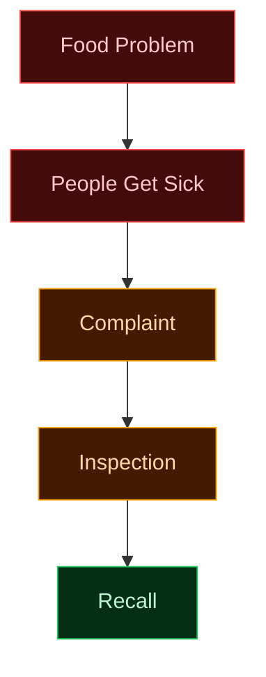

</td>
<td width="50%" valign="top">

**FOODGUARD X — predictive by design**

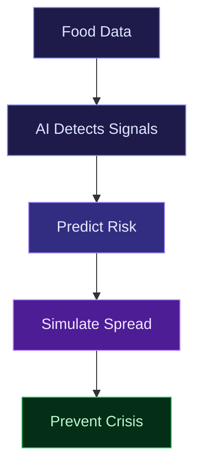

</td>
</tr>
</table>

> Traditional food safety asks **"Is this food unsafe?"**
> FOODGUARD X asks — **"Where could a problem happen next, why, how far could it spread, and what should we do before it's a crisis?"**

<br/>

## 02 — Core Idea · Digital Twin

A live, connected model of India's entire food journey — enriched with every signal around it.

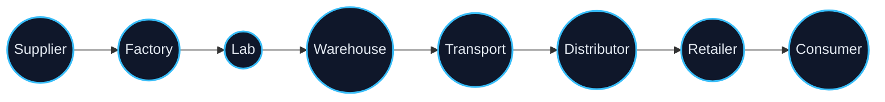

| Signal | Feeds |
|:--|:--|
| 🌦 Environmental | Weather, geography, flood & temperature data |
| 📋 Regulatory | Inspections, laboratory reports |
| 📦 Operational | Storage conditions, humidity, transport logs |
| 🗣 Human | Consumer & citizen complaints |
| 🕰 Historical | Past incidents, recurring failure patterns |

<br/>

## 03 — End-to-End Workflow

```mermaid
flowchart LR
    A[Ingestion] --> B[Validate & Normalize] --> C[Food DNA] --> D[AI / ML Analysis]
    D --> E[Risk + Anomaly Detection] --> F[Graph Investigation] --> G[Contamination Simulation]
    G --> H[AI Recommendation] --> I[Authority Action] --> J[Blockchain Audit] --> K[Feedback Loop]
    K -.retrains.-> D

    classDef ingest fill:#082f49,stroke:#0ea5e9,color:#e0f2fe
    classDef ai fill:#3b0764,stroke:#c084fc,color:#f3e8ff
    classDef action fill:#052e16,stroke:#22c55e,color:#dcfce7
    class A,B,C ingest
    class D,E,F,G,H ai
    class I,J,K action
```

<br/>

## 04 — System Architecture

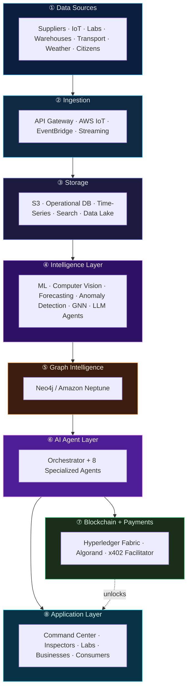

The **graph layer** models `Supplier → Batch → Factory → Warehouse → Transport → Distributor → Retailer → Consumer`, surfacing hidden multi-hop links a flat database would miss. **Blockchain** is used surgically — batch identity, lab verification, inspections, audit history — never as a database for everything. The **Algorand + x402 layer** sits alongside it purely for **pay-to-unlock premium intelligence** (deep forecasts, simulations, bulk API access) — it never gates safety-critical alerts.

<br/>

## 05 — Technology Stack

<table>
<tr><th>Layer</th><th>Stack</th><th>Purpose</th></tr>
<tr><td><b>Frontend</b></td><td>  </td><td>Command Center UI</td></tr>
<tr><td><b>Maps</b></td><td></td><td>India risk visualization</td></tr>
<tr><td><b>Backend</b></td><td> </td><td>APIs & AI services</td></tr>
<tr><td><b>AI / ML</b></td><td>  </td><td>LLM agents, training, vision</td></tr>
<tr><td><b>Graph</b></td><td></td><td>Supply-chain intelligence</td></tr>
<tr><td><b>Blockchain</b></td><td></td><td>Tamper-evident audit trail</td></tr>
<tr><td><b>Micropayments</b></td><td> </td><td>Pay-per-request unlock for premium AI features</td></tr>
<tr><td><b>Storage</b></td><td>  </td><td>Raw data, app data, search</td></tr>
<tr><td><b>Events / IoT</b></td><td> </td><td>Real-time ingestion</td></tr>
<tr><td><b>Compute</b></td><td>  </td><td>Containers & serverless</td></tr>
<tr><td><b>Auth / Ops</b></td><td>Cognito ·  · </td><td>Identity, monitoring, CI/CD</td></tr>
</table>

> Reflects target architecture — see `docs/architecture/` for implemented vs. planned.

<br/>

## 06 — Digital Food DNA & Time Machine

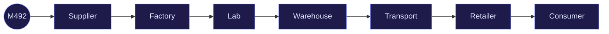

```
Current Safety Score:   84 / 100
Predicted (+24h):       62 / 100
Predicted (+48h):       31 / 100
```


> Base Food DNA + current risk score is **always free**. The full 72h forecast trendline with drivers is a premium unlock (see [§21](#21--algorand-x402-micropayments--pay-to-unlock)).

<br/>

## 07 — Simulation & Investigation Engine

**Contamination Spread Simulator** — models how a batch could travel through the network:

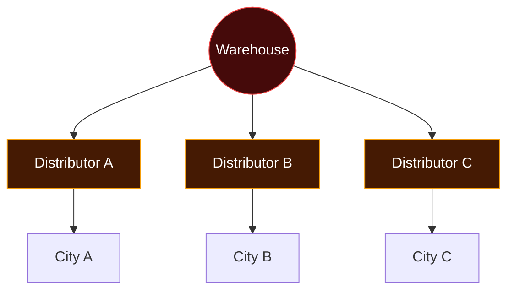

> **Core question it answers:** *"Which single intervention could reduce the highest potential exposure?"*

**Food Crime-Scene Investigator** — turns scattered complaints into an evidence chain:

```
23 Complaints → Same Product → Same Batch → Same Distributor → Same Warehouse → Possible Origin
```

**Unknown Risk Detector** — flags statistically unusual combinations no rule was ever written for:

```
⚠ NEW FOOD SAFETY ANOMALY DETECTED
```

**AI Inspector Copilot** — prioritizes where human attention matters most:

```
1. Warehouse #17     Risk 94/100   Cold-chain anomaly + downstream spread
2. Restaurant #42    Risk 87/100   Complaint cluster + supplier pattern
```

> None of this accuses anyone automatically — it generates evidence-based leads for human authorities. Running a full multi-city simulation or a Crime-Scene trace is metered via x402 for business/enterprise callers — regulators and authorities always get free, unmetered access.

<br/>

## 08 — Vision, Citizen Network & What-If Simulator

| Feature | Input | Output |
|:--|:--|:--|
| **AI Vision Inspector** | Food / packaging images, storage photos | Explainable flags — *"Seal geometry differs from expected pattern"* — a risk indicator, not a lab diagnosis |
| **Citizen Network** | Photo, video, voice, location, QR | Clusters unrelated reports into one possible common batch |
| **What-If Simulator** | *"Close this warehouse?"* | Estimated exposure reduction & new disruptions — estimates, not guarantees |

<br/>

## 09 — Blockchain Food Passport

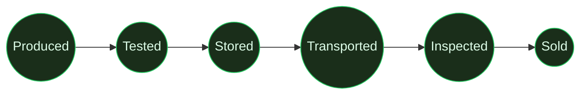

Every event becomes a tamper-evident record on **Hyperledger Fabric**. It preserves what was reported — it cannot make false input data true.

<br/>

## 10 — Live Risk Map & Consumer Experience

```
🟢 LOW      🟡 WATCH      🟠 HIGH      🔴 CRITICAL
```

Selecting a region always explains **why** — complaint spikes, cold-chain anomalies, weather, supply concentration, history.

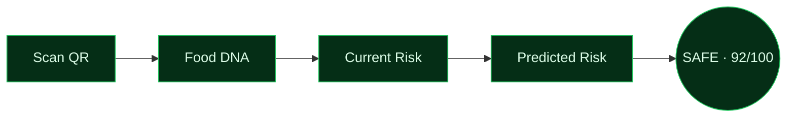

<br/>

## 11 — AI Agent Architecture

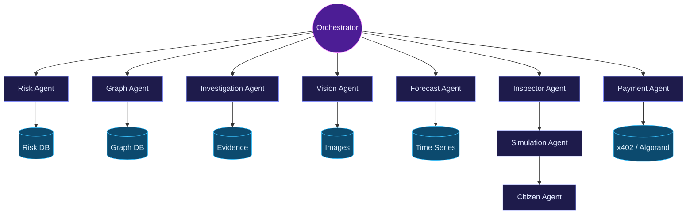

Nine core agents plus a dedicated **Payment Agent**, one orchestrator — each owns one job, coordinated centrally so recommendations stay consistent and explainable. The Payment Agent only decides *whether a call is authorized to proceed* — it never influences risk scoring.

<br/>

## 12 — Data Model

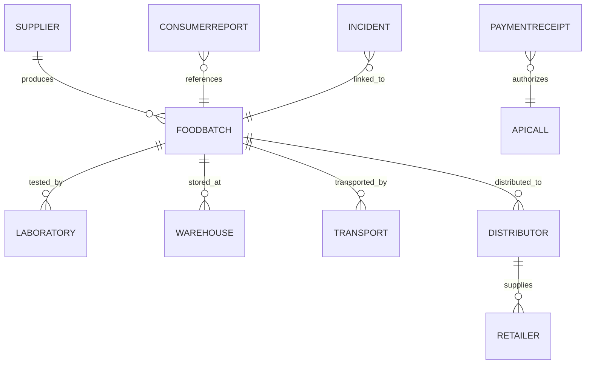

<br/>

## 13 — Security, Privacy & Responsible AI

- RBAC · encryption at rest/in transit · rate-limited, audited APIs
- Permissioned blockchain — only verified participants can write
- Citizen identity never exposed publicly; public data is aggregated/anonymized
- **Human approval required for every high-impact action** (recalls, shutdowns, alerts)
- **Payments never gate safety** — public health alerts, recalls, and regulator access are always free and unmetered; only non-critical premium analytics sit behind x402

> Predictions are probabilistic. Vision output is a risk indicator, not a lab test. Simulations are estimates, not guarantees. AI recommendations always need human validation.

<br/>

## 14 — Observability & MLOps

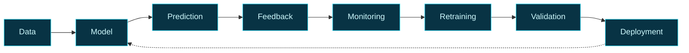

Model versioning · drift detection · prediction/API/infra monitoring · rollback · CI/CD · automated testing.

<br/>

## 15 — Project Structure

```
foodguard-x/
├── apps/            web · inspector · consumer
├── services/         api · risk-engine · graph-engine · vision-engine
│                     forecast-engine · simulation-engine · investigation-engine
│                     payment-engine        # x402 middleware + Algorand client
├── agents/           orchestrator + 8 specialized agents + payment-agent
├── blockchain/       Hyperledger Fabric chaincode & network config
│                     algorand/             # ASA config, smart contracts (PyTeal/Beaker)
├── ml/               training · inference · evaluation · feature-engineering
├── data/             schemas · pipelines · samples
├── infrastructure/   terraform · docker · kubernetes
├── docs/             architecture · api · decisions
└── README.md
```

<br/>

## 16 — API Design

```
POST /api/v1/batches                 GET  /api/v1/batches/{id}/risk
POST /api/v1/incidents               GET  /api/v1/incidents/{id}/investigation
GET  /api/v1/risk/india              GET  /api/v1/risk/region/{id}
POST /api/v1/simulation              POST /api/v1/vision/analyze
POST /api/v1/lab/analyze             POST /api/v1/citizen/report

# Premium — x402 metered (HTTP 402 Payment Required until settled)
GET  /api/v1/batches/{id}/forecast/72h        POST /api/v1/simulation/multi-city
POST /api/v1/investigation/deep-trace         GET  /api/v1/reports/bulk-export
POST /api/v1/payments/x402/challenge          POST /api/v1/payments/x402/verify
```

<br/>

## 17 — Key User Journeys

<table>
<tr><th>Authority</th><th>Inspector</th><th>Business</th><th>Consumer</th></tr>
<tr valign="top">
<td>Login → Risk Map → Threat → Investigation → Graph → Simulation → Action</td>
<td>Copilot → Priorities → Site Visit → Vision Inspector → Evidence → Submit</td>
<td>Register Batch → Lab Report → Track DNA → <b>Pay with Algo</b> → Deep Forecast → Resolve</td>
<td>Scan QR → Passport → Safety Score → Why → Act</td>
</tr>
</table>

<br/>

## 18 — Why This Is Different

| Traditional | FOODGUARD X |
|:--|:--|
| Reactive | Predictive |
| Manual investigation | AI-assisted investigation |
| Static records | Connected food graph |
| Test after the problem | Forecast before the crisis |
| Simple recall | Contamination simulation |
| Historical data only | Continuous self-learning |
| Flat subscriptions or none | Pay-per-call premium unlock via x402 + Algorand |

<br/>

## 19 — Real-World Walkthrough

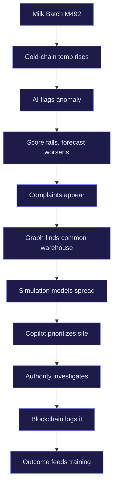

A sensor drifts out of range → score drops, forecast worsens → complaints trickle in → the graph traces them to one warehouse → simulation estimates the spread → the warehouse becomes today's top priority — all before it becomes a public health story. If a business wants the full 72h drill-down mid-incident, one tap of **"Pay with Algo"** settles a micro-payment on-chain and the deep forecast unlocks instantly.

<br/>

## 20 — Roadmap & Getting Started

| Phase | Focus |
|:--|:--|
| **1 · MVP** | Batch tracking, Food DNA, risk scoring, dashboard, citizen reporting |
| **2 · Intelligence** | Graph intelligence, forecasting, anomaly detection |
| **3 · Advanced AI** | Vision, agents, contamination simulation, what-if engine |
| **4 · Monetization** | x402 payment middleware, Algorand wallet integration, "Pay with Algo" unlock UX |
| **5 · National Scale** | IoT, multi-state deployment, enterprise integrations, full MLOps |

```bash
git clone https://github.com/<your-org>/foodguard-x.git && cd foodguard-x

cd services/api && npm install && npm run dev              # Backend
cd ../../ml && pip install -r requirements.txt && python main.py   # ML services
cd ../apps/web && npm install && npm run dev                # Frontend
cd ../../services/payment-engine && npm install && npm run dev    # x402 + Algorand

docker-compose up --build                                    # Or full stack
```

<br/>

## 21 — Algorand x402 Micropayments · Pay-to-Unlock

<div align="center">


</div>

FOODGUARD X keeps every **safety-critical** feature free forever — live risk map, recalls, alerts, citizen reporting, regulator/authority access. On top of that, non-critical **premium intelligence** (deep 72h forecasts, multi-city simulations, bulk exports, historical crime-scene traces) is metered per-call using the **x402 protocol**, settled instantly on **Algorand**. No subscriptions, no signup forms — the API itself asks for payment, and a wallet tap unlocks the response.

**Why x402 + Algorand:**
- **x402** revives the dormant HTTP `402 Payment Required` status — a server can respond "pay this much, to this address, for this resource," and the client's wallet settles it in the same request/response cycle.
- **Algorand** gives sub-4-second finality, near-zero fees, and native stablecoins (USDCa) — ideal for thousands of small, frequent unlocks rather than one big invoice.

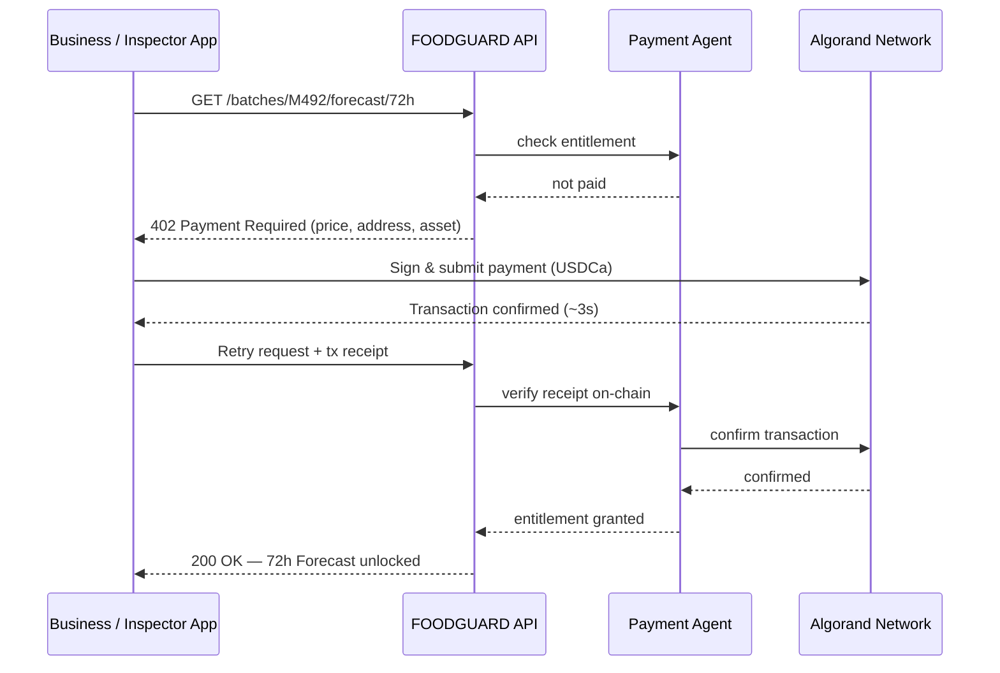

**"Pay with Algo" button — what happens on tap:**

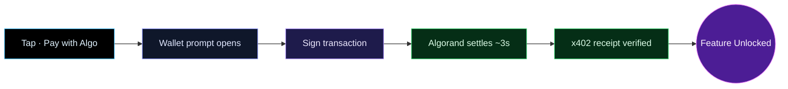

**What's free vs. what's pay-to-unlock:**

| Always Free | Pay-per-Unlock (x402) |
|:--|:--|
| Live risk map & current safety score | Full 72h forecast trendline with drivers |
| Recalls, public alerts, citizen reporting | Multi-city contamination simulation |
| Regulator / authority dashboards & API access | Deep food crime-scene trace across batches |
| Blockchain food passport lookup | Bulk historical data export / analytics API |
| Basic QR scan → safety score | AI Inspector Copilot priority feed (enterprise tier) |

**Sample "402" response the API sends before payment:**

```json
HTTP/1.1 402 Payment Required
{
  "x402Version": 1,
  "resource": "/api/v1/batches/M492/forecast/72h",
  "price": "0.25",
  "asset": "USDCa",
  "network": "algorand-mainnet",
  "payTo": "FGX7...ALGOADDR...9Q2K",
  "expiresIn": 120
}
```

**Client-side integration sketch:**

```javascript
// apps/web — "Pay with Algo" button handler
async function unlockPremium(resourceUrl) {
  let res = await fetch(resourceUrl);
  if (res.status === 402) {
    const { price, asset, payTo } = await res.json();
    const txId = await algorandWallet.pay({ to: payTo, amount: price, asset });
    res = await fetch(resourceUrl, {
      headers: { "X-PAYMENT": txId }
    });
  }
  return res.json(); // unlocked feature data
}
```

**New API endpoints:**

```
GET  /api/v1/batches/{id}/forecast/72h        → 402 until paid, then full forecast
POST /api/v1/simulation/multi-city            → 402 until paid, then simulation result
POST /api/v1/investigation/deep-trace         → 402 until paid, then evidence chain
GET  /api/v1/reports/bulk-export              → 402 until paid, then CSV/JSON export
POST /api/v1/payments/x402/challenge          → issue price + address for a resource
POST /api/v1/payments/x402/verify             → verify an on-chain Algorand receipt
```

> Payments are handled by the dedicated **Payment Agent** and a separate `payment-engine` service — kept fully isolated from the Risk, Forecast, and Investigation agents so a wallet outage or price change can **never** delay or block a safety-critical alert.

<br/>

---

<div align="center">


### FOODGUARD X
**Predict · Prevent · Trace · Simulate · Act**

*A digital brain for India's food-safety ecosystem.*

</div>
